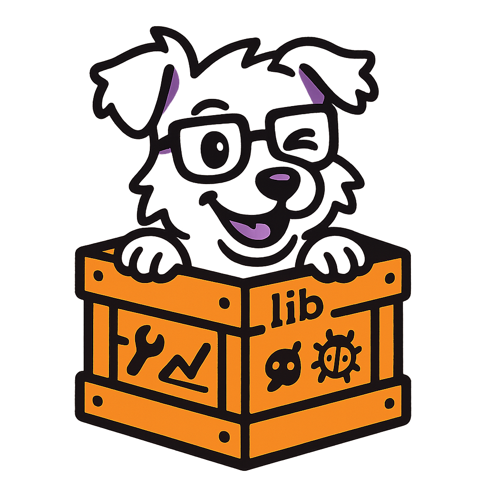

# `libdatadog`

<table>
<tr>
<td width="70%">

`libdatadog` provides a shared library containing common code used in the implementation of Datadog's libraries,
including [Continuous Profilers](https://docs.datadoghq.com/tracing/profiler/).

**NOTE**: If you're building a new Datadog library/profiler or want to contribute to Datadog's existing tools, you've come to the
right place!
Otherwise, this is possibly not the droid you were looking for.

</td>
<td width="30%" align="center">
  
</td>
</tr>
</table>

## Development

### Contributing

See [`CONTRIBUTING.md`](CONTRIBUTING.md).

### Building

Build `libdatadog` as usual with `cargo build`.

This repository uses git submodules for shared test data. If tests that depend
on fixture data fail because files are missing, initialize submodules from the
repository root:

```bash
git submodule update --init --recursive
```

#### Builder crate

You can generate a release using the builder crate. This will trigger all the necessary steps to create the libraries, binaries, headers and package config files needed to use a pre-built libdatadog binary in a (non-rust) project.

Here's one example of using the builder crate:

```bash
mkdir output-folder
cargo run --bin release -- --out output-folder
```

#### Build dependencies

- Rust 1.87.0 or newer with cargo. The exact version is pinned in `rust-toolchain.toml` at the workspace root and rustup installs it automatically. See the comment near `rust-version` in `Cargo.toml` for the constraints to check when bumping this version.
- `cbindgen` 0.29
- `cmake` and `protoc`

### Running tests

This project uses [cargo-nextest][nt] to run tests.

```bash
cargo nextest run
```

#### Installing cargo-nextest

The simplest way to install [cargo-nextest][nt] is to use `cargo install` like this.

```bash
cargo install --locked 'cargo-nextest@0.9.96'
```

#### Dev Containers

Dev Containers allow you to use a Docker container as a full-featured development environment with VS Code.

##### Prerequisites

- Install the [Dev Containers Extension](https://marketplace.visualstudio.com/items?itemName=ms-vscode-remote.remote-containers) in VS Code.
- Docker must be installed and running on your host machine.

##### Available Containers

We provide two Dev Container configurations:
- **Ubuntu**: Full-featured development environment with all dependencies installed
- **Alpine**: Lightweight alternative with minimal dependencies

##### Steps

1. Open a local VS Code window on the cloned repository.
2. Open the command palette (`Ctrl+Shift+P` or `Cmd+Shift+P` on macOS) and select **"Dev Containers: Reopen in Container"**.
3. Choose either **Ubuntu** or **Alpine** configuration when prompted.
4. VS Code will build and connect to the selected container environment.

The container includes all necessary dependencies for building and testing `libdatadog`.

#### Nix development shell

The Nix flake provides a reproducible, pinned shell with Rust, `cbindgen`, and native build tools.

This works natively under both Linux and Darwin.

##### Prerequisite: install Nix

This one-liner installs Nix isolated in `/nix`:

```bash
curl --proto '=https' --tlsv1.2 --location https://nixos.org/nix/install | sh -s -- --daemon
```

Enable the modern CLI and flakes in `/etc/nix/nix.conf`:

```bash
echo "experimental-features = nix-command flakes" | sudo tee -a /etc/nix/nix.conf
```

See the [Nix manual](https://nix.dev/manual/nix/2.28/installation/index.html) for more information.

##### Spawn an interactive shell

Spawn a shell with an environment set up to expose the tooling:

```bash
nix develop
```

Note: legacy `nix-shell` and `nix-build` are also available via the `flake-compat` shims.

##### Run commands

Alternatively, run individual commands:

```bash
nix develop --command cargo build --workspace --exclude builder
nix develop .#nightly --command cargo fmt --all -- --check
```

##### Debugging CI failures

- Reproduce the Nix CI build with `nix develop --command cargo build --workspace --exclude builder`.
- After an MSRV or nightly bump, update `rust-toolchain.toml` or `nightly-toolchain.toml`, then refresh `flake.lock` with `nix flake update`.

#### Docker container
A dockerfile is provided to run tests in a Ubuntu linux environment. This is particularly useful for running and debugging linux-only tests on macOS.

To build the docker image, from the root directory of the libdatadog project run
```bash
docker build -f local-linux.Dockerfile -t libdatadog-linux .
```

To start the docker container, you can run
```bash
docker run -it --privileged -v "$(pwd)":/libdatadog -v cargo-cache:/home/user/.cargo libdatadog-linux
```

This will:
1. Start the container in privileged mode to allow the container to run docker-in-docker, which is necessary for some integration tests.
1. Mount the current directory (the root of the libdatadog workspace) into the container at `/libdatadog`.
1. Mount a named volume `cargo-cache` to cache the cargo dependencies at ~/.cargo. This is helpful to avoid re-downloading dependencies every time you start the container, but isn't absolutely necessary.

The `$CARGO_TARGET_DIR` environment variable is set to `/libdatadog/docker-linux-target` in the container, so cargo will use the target directory in the mounted volume to avoid conflicts with the host's default target directory of `libdatadog/target`.

#### Skipping tracing integration tests

Tracing integration tests require docker to be installed and running. If you don't have docker installed or you want to skip these tests, you can run:

```bash
cargo nextest run -E '!test(tracing_integration_tests::)'
```

[nt]: https://nexte.st/
