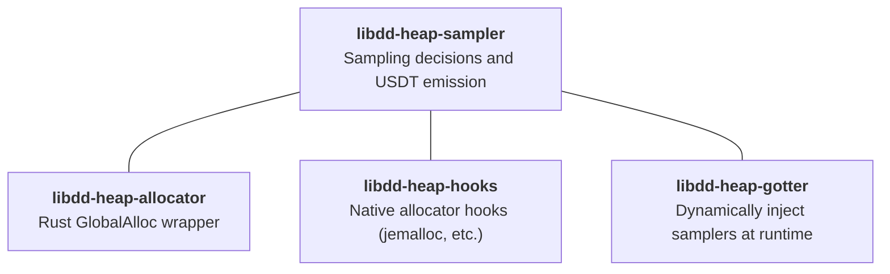

# Heap Profiling

This library forms the foundation of Datadog's application-side heap profiling support. It provides sampling functions that can be used to wrap each of the primary allocation and free functions of an arbitrary allocator.

For allocations that are sampled as well as the corresponding frees of these allocations, appropriate USDTs are
emitted such that an external process such as the [eBPF full host profiler](https://github.com/open-telemetry/opentelemetry-ebpf-profiler) can collect the samples as
well as the stack trace at the time they are emitted to ultimately emit as a heap profiling event stream.

## Docs

Two parts of this crate are fiddly enough that they get their own writeup:

* [docs/tagging.md](docs/tagging.md) - how we mark an allocation as sampled and recognise it again at free time
* [docs/realloc.md](docs/realloc.md) - how we handle `realloc`

## Use Cases

This profiling infrastructure will initially support these two use cases:

**Rust compile-time instrumentation**
A crate exposing a `GlobalAlloc` implementation will allow Rust users to, at compile time, opt into heap profiling. We
anticipate this will be shipped as a feature of `dd-trace-rs`. This addresses a pain point both internally with the
increase in Rust adoption in Datadog services, and would address the same pain point within the broader Rust community. 

**Python Runtime Instrumentation for _native_ library allocation sampling**
Today our python profiler cannot sample allocations occurring behind the FFI; we will extend `ddtrace-py` to load our dynamic
runtime patching mechanism such that, as native libraries are loaded, we intercept their allocators. As many popular python
libraries function largely as API glue around native libraries this will help close the allocation observability gap. 

**Example Apps**
* [libdd-heap-allocator/examples/usdt_demo.rs](../libdd-heap-allocator/examples/usdt_demo.rs) - spins allocating/freeing memory hooked by a `GlobalAllocator`
* [libdd-heap-gotter-ffi/examples/cdylib_demo.rs](../libdd-heap-gotter-ffi/examples/cdylib_demo.rs) - _dynamically loads_ the gotter library, then spins allocating memory hooked by GOT table rewriting

## Components



### Samplers - `libdd-heap-sampler` (you are here)
These are the foundational functions themselves containing the sampling logic and USDTs, and are intended to be used
within higher order constructs that bind them back to concrete allocator callsites. 
They are responsible for deciding whether or not to sample, and storing the information required to decide later on, at `free` time, if the given allocation _was_ sampled. We will cover:

**USDTs**

The actual USDTs emitted are:

* `ddheap:alloc(void *user, uint64_t size, uint64_t weight)` — fired on sampled allocations; `user` is the user-visible pointer, `size` in bytes, `weight` is the unbiased size estimator (`nsamples * interval`)
* `ddheap:free(void *ptr)` — fired when a previously-sampled allocation is freed
* `ddheap:mmap` - TODO 
* `ddheap:munmap` - TODO

**Allocations**

By splitting into `requested` and `created`, these are designed to be generic across different allocation functions 
(e.g. `malloc`, `operator new`, `aligned_alloc`, etc.). The job of binding these back to concrete callsites in a 
process is left to the other components - e.g. `libdd-heap-gotter`, `libdd-heap-allocator`, etc.     

The allocation-side pair is declared `static inline __attribute__((always_inline))` so the non-sampled fast path inlines
into the wrapper with no function-call overhead.

Note that the functions on the _allocation_ side will return an _updated_ allocation size. This will generally be the 
same as the requested allocation size, but may not always be as the sampling mechanism may choose to increase the 
allocation size in order to ease the process of tracking sampling decisions. The caller should pass this returned 
value through verbatim to the allocator it is wrapping.

* _`allocation requested`_ - called _before_ `malloc`, `operator new`, etc. Returns the size to actually allocate plus the sampling decision for this allocation.
* _`allocation created`_ - called _after_ the allocator returns; on sampled allocations applies the flag and emits the USDT.
* _`allocation freed`_ - used by `free`, `operator delete`, etc.

**Mappings** (TODO!) 
* _mapping created_ - used by `mmap`
* _mapping freed_ - used by `munmap`

### [Rust Allocator `libdd-heap-allocator`](../libdd-heap-allocator)
An implementation of a rust allocator using `libdd-heap-sampler` and wrapping an arbitrary allocator.

### [Native Allocator Hooks `libdd-heap-hooks`](../libdd-heap-hooks)
These implement the native profiling hooks for the various allocators we support, emitting the same USDTs in the sampling path as `libdd-heap-sampler` does. We will implement this for `jemalloc` first.

### [GOTter `libdd-heap-gotter`](../libdd-heap-gotter)
GOTter implements our GOT-patching mechanism to wrap (dynamically!) linked allocators in a running process.

## Cargo features

**`live-heap`** (off by default) - enables live-heap tracking. Sampled allocations are flagged and frees are sampled, 
so a profiler can balance allocs against frees. 

Separately, the runtime env var **`DD_HEAP_SAMPLING_ENABLED`** (`0`/`false`/
`no`/`off` to disable) bypasses sampling entirely at process start,
regardless of the compile-time feature.

## Regenerating bindings

The Rust FFI declarations in `src/generated/bindings.rs` and the
static-inline wrapper `src/generated/dd_heap_sampler_static_wrappers.c`
are produced by `bindgen` from the public headers under
`include/datadog/heap/`. **They are checked in so that day-to-day builds
do not depend on `libclang`** — this is the same pattern used by
`rusqlite`, `zstd-sys`, and other bindgen consumers, and it keeps our
internal build images (CentOS, Alpine) working without dragging LLVM in
as a runtime build dep.

The C implementation is still architecture-specific where needed:
`sample_flag.h` uses x86_64 header-prefixed magic pointers and aarch64
TBI pointer tagging. The generated Rust ABI intentionally allowlists only
the common public surface, so those internal arch-specific helpers and
constants are not emitted into `bindings.rs` and a single checked-in
binding set works for both supported Linux architectures.

```bash
# We use an env var and not a feature, as several parts of the libdatadog
# build turn on all features, and we don't want everything to need the extra
# build tooling. 
LIBDD_HEAP_SAMPLER_REGEN=1 cargo build -p libdd-heap-sampler
```

This refreshes `src/generated/bindings.rs` and
`src/generated/dd_heap_sampler_static_wrappers.c`. Commit the delta. CI's
`verify-heap-sampler-bindings` workflow runs the same command on every PR
and fails if the checked-in files are stale.

### Requirements

- **`libclang`** (`libclang-dev` on Debian/Ubuntu, `libclang-devel` on
  RPM distros, `brew install llvm` on macOS). This is the only hard
  requirement.

You do **not** need `bindgen-cli`, a cross libc, a cross Rust toolchain,
or a cross linker — `build.rs` invokes the `bindgen` crate directly and
only emits the arch-independent Rust-facing ABI.
