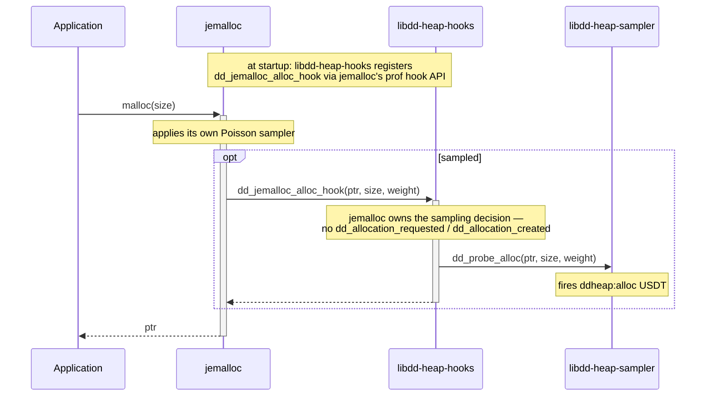
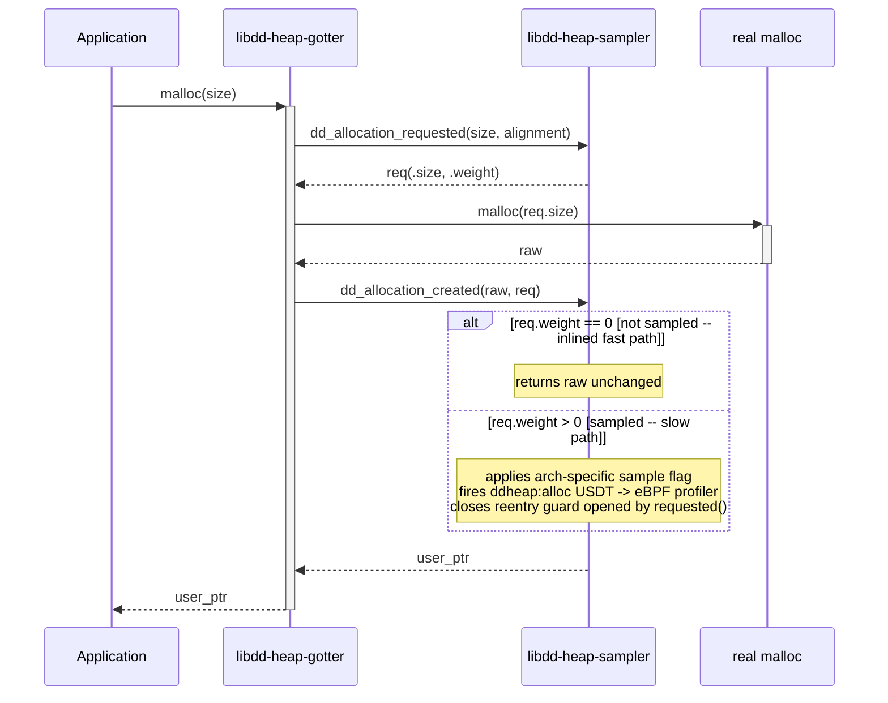

> [!WARNING]
> This is just a rough sketch of the outside of this API to push the heap profiling design along. There is a lot missing!

# Heap Profiling - Datadog Shared Lib

This library forms the foundation of Datadog's application-side heap profiling support; you can read more about
this initiative [over here](https://docs.google.com/document/d/1cy6OUisjW4_vAIaAu9G5l3RGuPPLT_MRZuhDPJHxXuw/edit?tab=t.z91c4h77tkuy#heading=h.dxy2mnwfeqrl). 

It provides sampling functions that can be used to wrap each of the primary allocation and free functions of an arbitrary allocator.

For allocations that are sampled as well as the corresponding frees of these allocations, appropriate USDTs are
emitted such that an external process such as the [eBPF full host profiler](TODO) can collect the samples as
well as the stack trace at the time they are emitted to ultimately emit as a heap profiling event stream.

The library is made up of multiple components; during the PoC phase, we should expect some level of "throw it all at the wall
and see what sticks", and would realistically expect the set of pieces reduces over time!

**TL;DR - what can I do _today_?**

If you want to **see it working right now**, the fastest path is the Rust allocator demo in [`libdd-heap-allocator`](../libdd-heap-allocator#running-the-demo), which wraps the system allocator, fires USDT probes on every heap event, and lets you observe them live with `bpftrace`.

## Components

### Samplers - `libdd-heap-sampler` (you are here)
These are the foundational functions themselves containing the sampling logic and USDTs, and are intended to be used
within higher order constructs that bind them back to concrete allocator callsites. 
They are responsible for deciding whether or not to sample, and storing the information required to decide later on, at `free` time, if the given allocation _was_ sampled. We will cover:

**USDTs**

The actual USDTs emitted are:

* `ddheap:alloc(void *user, uint64_t size, uint64_t weight)` — fired on sampled allocations; `user` is the user-visible pointer, `size` in bytes, `weight` is the unbiased size estimator (`nsamples * interval`)
* `ddheap:free(void *ptr)` — fired when a previously-sampled allocation is freed
* `ddheap:mmap` - TODO 
* `ddheap:munmap` - TODO

**Allocations**

By splitting into `requested` and `created`, these are designed to be generic across different allocation functions (e.g. `malloc`, `operator new`, `aligned_alloc`, etc.). The job of binding these back to concrete callsites in a process is left to the other components - e.g. `libddd-heap-gotter`, `libdd-heap-allocator`, etc.     

The allocation-side pair is declared `static inline __attribute__((always_inline))` so the non-sampled fast path inlines into the wrapper with no function-call overhead.

Note that the functions on the _allocation_ side will return an _updated_ allocation size. This will generally be the same as the requested allocation size, but may not always be as the sampling mechanism may choose to increase the allocation size in order to ease the process of tracking sampling decisions. The caller should pass this returned value through verbatim to the allocator it is wrapping.

* _allocation requested_ - called _before_ `malloc`, `operator new`, etc. Returns the size to actually allocate plus the sampling decision for this allocation.
* _allocation created_ - called _after_ the allocator returns; on sampled allocations applies the flag and emits the USDT.
* _allocation freed_ - used by `free`, `operator delete`, etc.

**Mappings** (TODO! Not in the code, yet) 
* _mapping created_ - used by `mmap`
* _mapping freed_ - used by `munmap`

### [Rust Allocator `libdd-heap-allocator`](../libdd-heap-allocator)
An implementation of a rust allocator using `libdd-heap-sampler` and wrapping an arbitrary allocator. This lets Rust users quickly setup sampled heap profiling within their application regardless of the particular allocator they are using.

### [Native Allocator Hooks `libdd-heap-hooks`](../libdd-heap-hooks)
These implement the native profiling hooks for the various allocators we support, emitting the same USDTs in the sampling path as `libdd-heap-sampler` does. Because these have their own sampling code, literally all we are using from `libdd-heap-sampler` are the USDTs themselves.

The process looks like this - a `jemalloc` specific hook plugs itself into `jemalloc`, and then uses _only_ the USDT emission from the `libdd-heap-samplers` library.

We will implement this for `jemalloc` first!

### [GOTter `libdd-heap-gotter`](../libdd-heap-gotter)
GOTter will implement our GOT-patching mechanism to  wrap (dynamically!) linked allocators in a running process.
This follows the same approach as `ddprof`, and may prove useful to inject via our tracing libraries into running processes such as python.

When the GOTter does a full wrap of the allocating surface of a process, we end up with a process that looks like this:

## TODO General

Lots to do!

Coarse grained:

* The entire eBPF full host profiler side of things
* Implement [libdd-heap-gotter](../libdd-heap-gotter), our GOT injection library
* Implement [libdd-heap-hooks](../libdd-heap-hooks) for `jemalloc` and `mimalloc`, firing our USDTs using their sampling infrastructure 
* Performance benchmarking 

Fiddly detail:

* We need to be clever about how we track on x86-64. At the moment, reading _before_ the pointer may in some cases segfault out. We could guard this (only do it if we are not within X bytes of a page boundary) - but then we will either miss sampled allocations on free, _or_ on the allocating side, have to actively not-sample things we'd otherwise sample based on the returned pointer. Room for exploration!
* Maybe add a dedicated `realloc` hook. The default `GlobalAlloc::realloc`
  dispatch used by `libdd-heap-allocator` produces two sample events (one
  alloc, one dealloc) per realloc. Is this _what we want_? 
